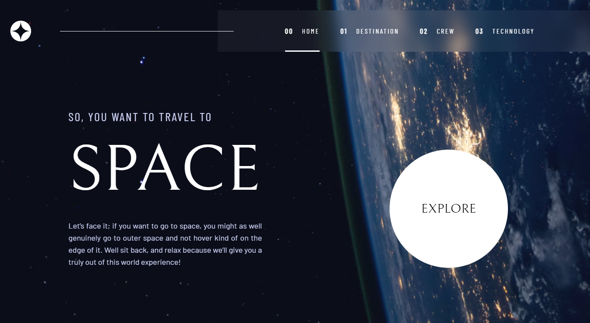
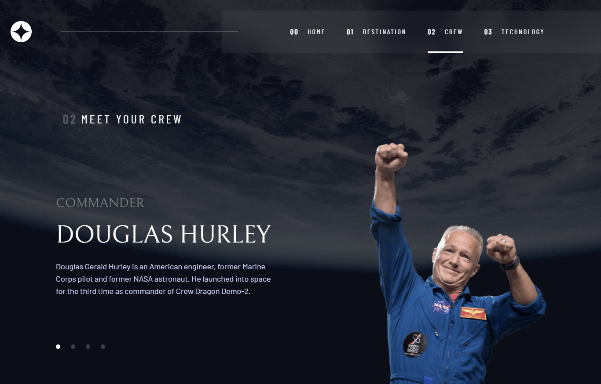

# Frontend Mentor - Space tourism website solution

This is a solution to the [Space tourism website challenge on Frontend Mentor](https://www.frontendmentor.io/challenges/space-tourism-multipage-website-gRWj1URZ3). Frontend Mentor challenges help you improve your coding skills by building realistic projects.

## Table of contents

- [Overview](#overview)
  - [The challenge](#the-challenge)
  - [Screenshot](#screenshot)
  - [Links](#links)
- [My process](#my-process)
  - [Built with](#built-with)
  - [Continued development](#continued-development)
- [Author](#author)

## Overview

### The challenge

Users should be able to:

- View the optimal layout for each of the website's pages depending on their device's screen size
- See hover states for all interactive elements on the page
- View each page and be able to toggle between the tabs to see new information

### Screenshot

### Links

- Solution URL: [Add solution URL here](https://github.com/JamesBarr456/Space-Tourism)
- Live Site URL: [Add live site URL here](https://space-tourism-challenger.netlify.app/)

## My process

### Built with

- Semantic HTML5 markup
- CSS custom properties
- Flexbox
- Mobile-first workflow
- [Vite](https://vitejs.dev/)
- [Tailwind CSS](https://tailwindcss.com/) - CSS framework
- [React](https://reactjs.org/) - JS library

### Continued development

I feel that this project can still be greatly improved, especially in terms of the components or finding ways to save code while achieving the same result. This project definitely had its challenges, but it helped me to continue learning and push myself to find solutions to the problems.

## Author

- Github: [Barreto Santiago Emmanuel](https://github.com/JamesBarr456)
- Frotend Mentor: [@JamesBarr456](https://www.frontendmentor.io/profile/JamesBarr456)
- Instagram: [@barretoemmanuel](https://www.instagram.com/barretoemmanuel/)
